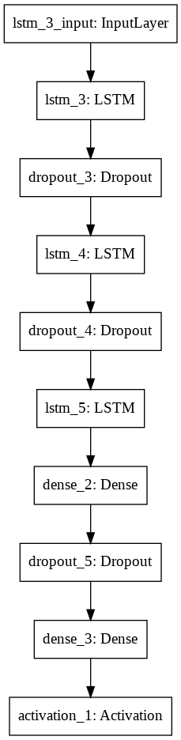

# Output of this project
https://soundcloud.com/ksuen/deep-learning-generated-music

The song quality is actually quite promising, by using a simple RNN model (LSTM to be specific) with around a dozen pop songs as the training datasets. Can't really tell if it's a machine-generated one or human.

Music generation is not a new topic at all, but it's an interesting one to start with. The improvement could be adding data on the duration between notes and more instrument samples into the model training.

